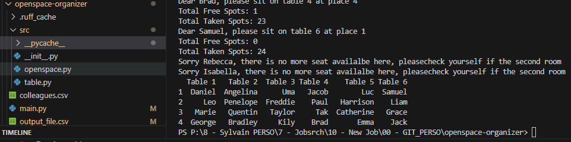

# Project Objective : Create an Openspace Organizer for office or more

## Main features : 
- The program takes an XL list of people as argument
- The program distributes people randomly on existing tables
- The program deal with the possibility of having too many people in the room
- The program display the number of people in the room & the number of seats that are left
- the code output a dataframe with the final repartition (name) in the terminal and in an xl file (output_file.csv)

## Installation and running
- running :   3_openspace-organizer> python main.py
- src folder contains the classes and functions script 
- input is the colleagues.csv file (default one is  inthe folder) 
- you may change the nb of seats per table in the table.py script, class Table argument - default is 4 
- you change the nb of table in the openspace.py script class OpenSpace argument -default is 6  
- built on python version 3.11.5

